# estateresearch

J-REIT（不動産投資信託）が取得・保有・売却する物件のみを掲載する、個人開発のリサーチサイト。Next.js (App Router, TypeScript) + Supabase (Postgres/Auth) + Vercel。

コンシューマー向け（SUUMO/at homeのような個人の部屋探し）ではなく、[japan-reit.com](https://www.japan-reit.com/report/shutoku/) が公開している取得実績・売却実績の形式に合わせて設計しています。J-REITで証券化されていない物件は対象外です。

セットアップ手順・設計方針は [docs/SETUP_PLAN.md](docs/SETUP_PLAN.md)、プロジェクト運用ルール（RLS必須事項など）は [CLAUDE.md](CLAUDE.md) を参照。

## Getting Started

```bash
mise install
pnpm install
supabase start
pnpm dev
```

<http://localhost:3000> を開く。

## データモデル

すべてのマスタ・履歴テーブルは **認証済みユーザーに読み取り専用**（`select to authenticated using (true)` + `revoke insert/update/delete from anon, authenticated`）。書き込みは migration・seed・service role（将来のスクレイパー/ETLジョブ）経由のみ。個人のリサーチメモ（`research_notes`）だけが所有者本人に閉じたRLSを持つ。

```mermaid
erDiagram
    REGIONS ||--o{ PROPERTIES : classifies
    PROPERTIES ||--o{ ACQUISITIONS : "acquired via"
    PROPERTIES ||--o{ DISPOSITIONS : "disposed via"
    REITS ||--o{ ACQUISITIONS : acquires
    REITS ||--o{ DISPOSITIONS : disposes
    REITS ||--o{ REIT_MARKET_SNAPSHOTS : "daily snapshot"
    REITS ||--o{ REIT_DISTRIBUTIONS : "per-period distribution"
    REITS ||--o{ REIT_PORTFOLIO_METRICS : "per-period financials"
    SOURCES ||--o{ ACQUISITIONS : sources
    SOURCES ||--o{ DISPOSITIONS : sources
    SOURCES ||--o{ RAW_TRANSACTIONS : scrapes
    PROPERTIES ||--o{ RAW_TRANSACTIONS : "matched to (nullable)"
    REITS ||--o{ RAW_TRANSACTIONS : "matched to (nullable)"
    PROPERTIES ||--o{ RESEARCH_NOTES : "noted on"
    AUTH_USERS ||--|| PROFILES : "1:1"
    AUTH_USERS ||--o{ RESEARCH_NOTES : owns

    REITS {
        uuid id PK
        text securities_code UK "証券コード"
        text name "投資法人名"
        text sponsor
        text asset_manager
        text primary_use_type
        int fiscal_month "決算期(1-12)"
        date listed_at
    }
    PROPERTIES {
        uuid id PK
        text name "物件名"
        text address
        text prefecture
        uuid region_id FK
        text use_type "residential/office/retail/logistics/hotel/healthcare/land/other"
        int built_year
        numeric total_floor_area_sqm
    }
    REGIONS {
        uuid id PK
        text name UK "japan-reit.comの11区分"
        int sort_order
    }
    ACQUISITIONS {
        uuid id PK
        uuid property_id FK
        uuid reit_id FK
        date acquisition_date
        bigint acquisition_price_yen
        numeric acquisition_cap_rate "取得時CR"
        numeric ownership_ratio "准共有持分%"
        text seller
        uuid source_id FK
    }
    DISPOSITIONS {
        uuid id PK
        uuid property_id FK
        uuid reit_id FK
        date disposition_date
        bigint disposition_price_yen
        bigint gain_loss_yen "取得額差額"
        numeric ownership_ratio
        text buyer
        uuid source_id FK
    }
    REIT_MARKET_SNAPSHOTS {
        uuid id PK
        uuid reit_id FK
        date snapshot_date
        bigint unit_price_yen "投資口価格"
        numeric unit_price_change_pct "騰落率"
        numeric distribution_yield_pct
        bigint nav_per_unit_yen
        numeric nav_multiple "NAV倍率"
        bigint market_cap_yen
        bigint trading_volume_units
    }
    REIT_DISTRIBUTIONS {
        uuid id PK
        uuid reit_id FK
        date fiscal_period_end
        bigint distribution_per_unit_yen
        boolean is_forecast "実績/予想"
    }
    REIT_PORTFOLIO_METRICS {
        uuid id PK
        uuid reit_id FK
        date fiscal_period_end
        bigint asset_size_yen "資産規模"
        int property_count "保有棟数"
        numeric average_building_age_years
        numeric noi_yield_pct
        numeric unrealized_gain_loss_pct
        bigint annual_distribution_yen
        numeric roe_pct
        numeric interest_bearing_debt_ratio_pct
    }
    SOURCES {
        uuid id PK
        text code UK "japan_reit_com / manual"
        text name
        text base_url
    }
    RAW_TRANSACTIONS {
        uuid id PK
        uuid source_id FK
        text transaction_type "acquisition/disposition"
        jsonb raw_payload
        text match_status "unmatched/auto_matched/manual_matched/rejected"
        uuid matched_property_id FK
        uuid matched_reit_id FK
    }
    PROFILES {
        uuid id PK "= auth.users.id"
        text display_name
    }
    RESEARCH_NOTES {
        uuid id PK
        uuid owner_id FK "= auth.users.id"
        uuid property_id FK
        text title
        text body
    }
    AUTH_USERS {
        uuid id PK
    }
```



### 補足

- `property_holdings` はテーブルではなく **VIEW**（`security_invoker = true`）。`acquisitions` の持分合計から `dispositions` の持分合計を引いた「現在の純保有割合」を導出し、0より大きい行だけを返す。同一物件を複数REITが持分（准共有）で保有するケースは `acquisitions`/`dispositions` の `ownership_ratio` 列で表現し、このビューが「今どのREITが何%持っているか」を常に矛盾なく返す。
- `raw_transactions` は将来のスクレイピング/名寄せ用の取り込み層。`anon`・`authenticated` どちらからも一切アクセスできない（`using (false)` の明示的な拒否ポリシー + grant revoke）。マッチング前の生データをアプリのAPI表面に出さないための設計。
- `reit_market_snapshots`（日次）と `reit_distributions` / `reit_portfolio_metrics`（決算期ごと）はあえて別テーブル。更新頻度が違うデータを1つのテーブルに混ぜるとNULLだらけになるため。

## 現在の実装状況

- ローカル: Next.js dev server / Supabase ローカルスタック（Postgres・Auth・Storage・Mailpit）
- 認証: Email（パスワード + マジックリンク）、`@supabase/ssr` によるセッション管理
- 画面: `/login`、`/notes`（自分のリサーチメモ、RLSで他ユーザーから不可視）、`/properties`（J-REIT保有物件一覧、取得・売却履歴つき）
- 品質ゲート: commit時に自動でシークレットスキャン + Biome + tsc + Vitest（`.claude/hooks/quality-check.sh`）
- RLS: migrationごとに `pnpm check:rls` の静的検査 + pgTAP 19テストで検証
- クラウド: Supabase Cloud (`jawssqxgzinskwsrobfx`, ap-northeast-1) にスキーマ反映済み、Vercelプロジェクト作成・GitHub連携済み
- 未実装: japan-reit.com からのスクレイピング/ETLジョブ（`raw_transactions` はスキーマのみ用意）、物件の詳細情報（鑑定評価額・稼働率等、会員限定ページ由来）
